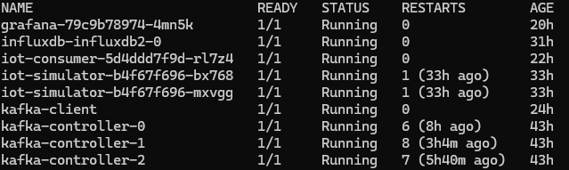

# IoT-Simulator DevOps Project

## Project Description
The IoT DevOps project integrates Terraform, Kubernetes, Docker, Kafka, InfluxDB, and Grafana to simulate IoT devices sending data to the Azure cloud. These data are processed by Apache Kafka, stored in InfluxDB, and visualized using Grafana.

## Architecture

1. **Azure Kubernetes Service (AKS)** - Manages containers within a Kubernetes cluster.
2. **Azure Container Registry (ACR)** - Stores Docker images.
3. **Terraform** - Infrastructure as Code (IaC) for cloud deployment.
4. **Docker** - Containerization of applications.
5. **Kafka** - Message queuing and data streaming.
6. **InfluxDB** - Time-series database for storing data.
7. **Grafana** - Data visualization from InfluxDB.
8. **Ansible** - Automation of deployment processes.
9. **GitHub Actions** - CI/CD pipeline for deployment automation.


## Requirements

- **Locally on your computer**:
  - Terraform
  - Azure CLI
  - Docker
  - kubectl
  - Helm
  - Ansible
  - Git

- **In Azure**:
  - Azure Kubernetes Service (AKS)
  - Azure Container Registry (ACR)
  - Storage for InfluxDB

## Deployment Steps

### 1. Creating Infrastructure in Azure
- Install Terraform and Azure CLI.
- Configure Terraform in the `main.tf` file.
- Run:
  ```sh
  terraform init
  terraform apply
  ```

### 2. AKS Configuration
- Retrieve AKS credentials:
  ```sh
  az aks get-credentials --resource-group iot-project-rg --name iot-aks-cluster
  ```
- Verify the connection:
  ```sh
  kubectl get nodes
  ```

### 3. Installing Kafka in Kubernetes
- Install Apache Kafka:
  ```sh
  helm repo add bitnami https://charts.bitnami.com/bitnami
  helm install kafka bitnami/kafka --namespace default
  ```
- Check if Kafka is running:
  ```sh
  kubectl get pods
  ```

### 4. Building and Deploying Applications
#### 4.1. IoT Device Simulation (Producer)
- The `app.py` script simulates an IoT device and sends data to Kafka.
- Build the Docker image:
  ```sh
  docker build -t iot-simulator:latest ./producerKafka
  docker tag iot-simulator:latest <acr_name>.azurecr.io/iot-simulator:latest
  docker push <acr_name>.azurecr.io/iot-simulator:latest
  ```

#### 4.2. Data Consumer
- The `consumer.py` script consumes data from Kafka and writes it to InfluxDB.
- Build the Docker image:
  ```sh
  docker build -t iot-consumer:latest ./consumerKafka
  docker tag iot-consumer:latest <acr_name>.azurecr.io/iot-consumer:latest
  docker push <acr_name>.azurecr.io/iot-consumer:latest
  ```

#### 4.3. Deploying Applications in Kubernetes
- Deploy the applications:
  ```sh
  kubectl apply -f iot-simulator-deployment.yaml
  kubectl apply -f iot-consumer-deployment.yaml
  ```
- Verify deployment:
  ```sh
  kubectl get pods
  ```

### 5. Installing InfluxDB
- Install InfluxDB in the cluster:
  ```sh
  helm install influxdb influxdata/influxdb --namespace default
  ```
- Check database status:
  ```sh
  kubectl logs -f influxdb-0 -n default
  ```

### 6. Visualizing Data in Grafana
- Install Grafana:
  ```sh
  helm install grafana bitnami/grafana --namespace default
  ```
- Retrieve the admin password:
  ```sh
  kubectl get secret --namespace default grafana -o jsonpath="{.data.admin-password}" | base64 --decode ; echo
  ```
- Log in to Grafana and configure InfluxDB as a data source.

### 7. Monitoring and Alerts
- In Grafana, configure queries for InfluxDB and set alerts based on temperature thresholds.

### 8. CI/CD Automation
- Add GitHub Actions workflows in `.github/workflows/ci_cd.yml`.
- The pipeline builds and deploys the application whenever there are changes to the code.

## Final Result

### 1. Setup
Ensure you have the required resources running by executing:

```sh
kubectl get pods -n default
```



To check the sent data, run:

```sh
kubectl logs -f iot-simulator-yours
```


---

### 2. InfluxDB
To access the InfluxDB CLI and inspect the database, execute:

```sh
kubectl exec -it influxdb-influxdb2-0 --namespace default -- /bin/sh
```

Run the following query to check the stored data:

```sh
influx query '
  from(bucket:"iot_data")
  |> range(start: -1h)
  |> filter(fn: (r) => r._measurement == "iot_measurements")'
```


---

### 3. Data Visualization Using Grafana
To expose Grafana, run:

```sh
kubectl port-forward svc/grafana 3000:80 -n default
```

Then, open [http://localhost:3000](http://localhost:3000) and create a dashboard using InfluxDB as the data source.

Example query to fetch data from the database:

```sh
from(bucket: "iot_data")
  |> range(start: -1h)
  |> filter(fn: (r) => r["_measurement"] == "iot_measurements")
  |> filter(fn: (r) => r["_field"] == "temperature" or r["_field"] == "humidity")
  |> aggregateWindow(every: 1m, fn: mean)
  |> yield()
```


Alternative query to filter by device ID:

```sh
from(bucket: "iot_data")
  |> range(start: -1h)
  |> filter(fn: (r) => r._measurement == "iot_measurements")
  |> filter(fn: (r) => r._field == "temperature" or r["_field"] == "humidity")
  |> filter(fn: (r) => r.device_id == "1")
  |> aggregateWindow(every: 1m, fn: mean, createEmpty: false)
  |> yield(name: "mean")
```


You can also set up alerts in Grafana, such as sending an email notification when the temperature exceeds a predefined threshold.


---

### 4. CI/CD Using GitHub Actions
To configure CI/CD:

1. Navigate to **Repository → Settings → Secrets and variables → Actions**.
2. Create a new secret named `AZURE_CREDENTIALS` and paste the JSON output from the following command:

   ```sh
   az ad sp create-for-rbac
   ```

If everything is set up correctly, each time the code is updated, the CI/CD pipeline will:
- Build & push Docker images
- Deploy the application to AKS


## Summary
This project integrates IoT, DevOps, and cloud technologies, providing a full data processing and visualization pipeline. Further enhancements can include improved scalability and additional security measures.

